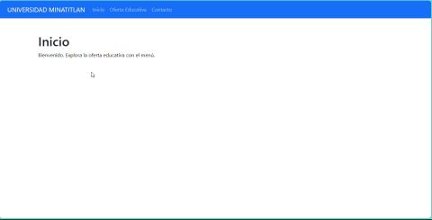

<h1 align="center">MENÚ OSSVI</h1>
<p align="center">Menú Dinámico y Recursivo Hecho en Flask</p>

<p align="center">
  
</p>

<p align="center">
  <a href="#"></a>
</p>

<p align="center">
  <a href="https://www.python.org/">
    
  </a>
  <a href="https://flask.palletsprojects.com/">
    
  </a>
  <a href="https://getbootstrap.com/">
    
  </a>
</p>

<p align="center">
  
</p>

<br>

<p align="center">
  <a href="https://www.instagram.com/ossvi_1.0/">
    
  </a>
  <a href="https://wa.me/5219221207843">
    
  </a>
  <a href="https://github.com/Ossvi1">
    
  </a>
</p>

<p align="center">Aquí te dejo mis redes sociales por si tienes alguna duda o necesitas ayuda con el proyecto 👆🏻</p>

---

## 🚀 ¿Cómo instalar y ejecutar este proyecto?

1. **Clona el repositorio**
   ```bash
   git clone https://github.com/tu_usuario/ossvi-menu.git
   cd ossvi-menu
   ```

2. **Crea y activa un entorno virtual (opcional pero recomendado)**
   ```bash
   python -m venv .venv
   ```

   - En Windows:
     ```bash
     .venv\Scripts\activate
     ```
   - En Mac/Linux:
     ```bash
     source .venv/bin/activate
     ```

3. **Instala las dependencias**
   ```bash
   pip install -r requirements.txt
   ```

4. **Ejecuta la app**
   ```bash
   python menusflask/main.py
   ```

---

<h3 align="center">🎞️ Ejemplo del menú en funcionamiento</h3>

<p align="center">
  
</p>